# **HighRadius Git**
Git is a distributed version-control system used for source-code mangement. Unlike CVS it supports for non-linear development i.e. we can work on thousands of parrellel features at a time.

 In HighRadius we use Git through eclipse but there is chance of doing better if we use git-bash in parallel.

In this article we will discuss about to git-bash shell and also discover, how to make our task easy. In Conclusion, We will be using eclipse as well git-bash, as per our need convience.

---

## **Challenges in Eclipse**

### WorkSpace Setup
This is one time setup and might not be a big issue for a developer but definetly it is a boring to clone each repository one by one and setting up the remotes.
If we properly setup the remotes then this setup might take 120-150 minutes. My question is can we do something better? 

### Daily Update
In HighRadius a product like EIPP has more than 10 repositories and to keep our Local repostitory and User's Public Repositories in sync with Official Reopositories we have to perform these three operation:

1. Fetch the latest changes from Official Repositories.
2. Merge the changes.
3. Push the changes to User's Public Reopositories.

This task has to be perfomed frequently and for all the branches available in a repository. This is time consuming and a very boring task for a developer.


### Working on Feature Branch

It is always better to work on a feature branch, In HighRadius  you can call a feature branch is your user-story branch.

To work in user-story branch we have to first create a user-story branch in all the repositories, this is really once again a tidious task as we have to repeat the same process for all the repositories. 

### Writing a Commit Message

Most of you might not be agree but believe me writing a good commit message is not so easy, it takes times and there is high probablity that every time you chage your commit message format.

At later bad commit message become very difficult to track.

### Tracking the changes in User-Story Branch

In eclipse there is no easy way to track the files which are changed/created while working on User-Story.
 
You can only compare your changes to some specific branch or commit.

---

## **Automate the Boring Stuff**

As we have discussed eclipse plugin of git is not sufficient when there are multiple repositories to work on. We will try to minimize our time and manual effort. This thing can be done through the bash script. We will use GIT bash as an environment to run the script.

Please [click here](https://github.com/Nitesh-Nandan/MarkDown/blob/master/InstallationofGitBash.md) to see the installation process of Git Bash shell in your system.

Let me give you a brief context of Git Bash Shell before I continue. 

Bash is a UNIX Shell and command language interpreter, and git bash is build on top of it to support the git commands.


### **Important Links**

- [First time git setup](#first-time-git-setup)
- [Boost Your Git Bash Shell (Script Setup)](#boost-your-git-bash-shell)
- [Setting up workspace](#setting-up-workspace)
- [Setting up the remotes: See the Advantage](#setting-up-the-remotes-see-the-advantage)
- [Feature Branch Creation](#feature-branch-creation)
- [Taking Daily Update](#taking-daily-update)
- [Checking the update status](#checking-the-update-status)
- [Merging the feature Branch](#merging-the-feature-branch)
- [Tracking the conflict file](#tracking-the-conflict-file)
- [Tracking the Modified/Untracked file](#tracking-the-modified/untracked-file)
- [Deleting the feature Branch](#deleting-the-feature-branch)
- [Fetching the code from user's cloud repository](#fetching-the-code-from-user's-cloud-repository)
- [Commit Message Generation](#commit-message-generation)
- [Short Hand commands](#short-hand-commands)
- [Frequently asked questitions (FAQ)](#frequently-asked-questiton-(faq))

---
## [**First time git setup**](#important-links)

### Setting up email & username
<pre>
   $ git config --global user.name "nitesh.nandan"
   $ git config --global user.email "nitesh.nandan@highradius.com"
</pre>

Rememeber this username or email is not you credentials, actually there is no relation between your credentials and the username that you provided.

### Setting up your editor

Default Git Bash comes with vim editor (a unix command line editor). The editor is not very user friendly. So we will setup sublime text editor: A light weight cross-platform code editor.

You can download the portable version of editor from: <br>
&nbsp;&nbsp;&nbsp;&nbsp; Url:&nbsp; https://www.sublimetext.com/3 <br>
or you can [click here](https://www.sublimetext.com/3).

Once you downloaded the portable version, unzip the file. Open the folder 
you will se something like this: <br>

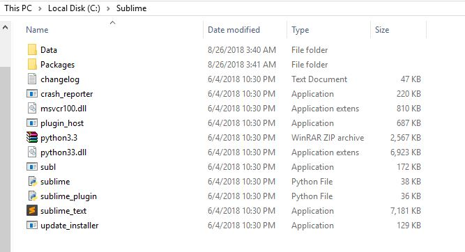<br>

### Linking sublime text 3 to bash shell

Reaname the parent folder containing subl application as sublime and copy this folder to your C drive (you have freedom to choose your suitable directory).

If you go with the C drive, the path of subl application should be "c:/sublime/subl.exe'. Open the command prompt and type full path of subl.exe, a sublime editor will be open confirming the correct path. Now link the same path to git bash, to do so open the git bash shell
<pre>
&nbsp;&nbsp; git config --global core.editor "'c:/sublime/subl.exe' -w"
</pre>

The linking of editor is done.

### Making you file system platform independent

As we know, the code continously swithches between different platforms (linux, windows), the <strong><i>end file flag</i></strong> is different for both the platforms, so to maintain a uniformity across the platform we have to set <strong><i>autoclrf</i></strong> flag to false. Open your git bash and execute the following commnad: &nbsp;
<pre>
    git config --global core.autoclrf false
</pre>

Congrats! you have done with your basic setup.

---

## [**Boost Your Git Bash Shell**](#important-links)

Once you have downloaded the git bash shell if not then please ([click here](https://github.com/Nitesh-Nandan/MarkDown/blob/master/InstallationofGitBash.md)) to know the installation procedure.

After successfull install:&nbsp; Steps are to be followed:
- Step 1:&nbsp; Download or clone the Github Repostitory from [here](). <br> &nbsp;&nbsp;&nbsp;&nbsp;&nbsp;&nbsp; url:&nbsp; www.gitNiteshNandan.com <br>

- Step 2:&nbsp; Copy the scripts folder and paste in your <strong>home</strong> directory. <br>&nbsp;&nbsp;&nbsp;&nbsp;&nbsp;&nbsp;  for eg:&nbsp; <strong>C:/Users/nitesh.nandan</strong> (for me). <br>

- Step 3:&nbsp; Open the   <strong><i>.bash_profile</i></strong>  with text editor and replace nitesh.nandan to you ldap id. <br>

- Step 4:&nbsp; Save the file and paste in your home directory.<br>

- Step 5:&nbsp; If you already have <strong><i>.bash_profile</i></strong> then replace the file with newly downloaded file.<br>

-  ******************* DONE  **********************

---


## [**Setting up workspace**](#important-links) 

In CVS we used to checkout the project, in similar way we clone the project in GIT. 

Every user has it's own public repository where the forked repository resides, and we clone the projects from our public repository.

Most of the team in HighRadius works on multiple project, so cloning each project one by one using eclipse is not encouraged. 

So, there is a shell script (clone.sh) which clone all the project in one go. This script has written considering EIPP cloud. So, we have to make few line of change before using it.

Open the <strong>clone.sh</strong> script in one of the text editor (you can use sublime is you have installed). You will find something like this: <br>


``` bash
#!/bin/bash
eipp_cloud="agent_eipp eipp_common eipp_correspondence eipp_model eipp_ui eipp_core_util eipp_gateway eipp_payment eipp_agent_launcher RRDMSProject eipp_command_center command_center"

ldapIds="alekya.pabbishet aman.mishra annie.jeyaraj aviral.srivasta kranthi.bejjarapu malay.satapathy mallikarjuna.vel prashant.t pramod.b praveen.tiwary sarvani.ch nitesh.nandan"
/*
  some code here
*/
for project in $eipp_cloud
do
/*
  some code here
*/
done

```


Here you have to change few line. At second line there will be **eipp_cloud**
variable which holds the projects name seperated by space. Change this variable name and its value according to your requirement.

The next variable is **ldapIds**  which holds ldapId for your team member. Repalce these ldapd's with you team member's ldap. In the next section I will be discuss the importance of ldapIds.

There is two different ways in which you can run clone.sh.

<pre>
    $ clone [ldapId (username)]
    $ clone [ldapId (username)] [branch_name]
</pre>

Here **ldapId** is mandatory argument where branch_name is optional. 99.99% of the time we will not pass the branch_name since **default** it will checkout **falcondev** branch for you.


### Adding Cloned Repositories to the eclipse Workspace

- Step 1:&nbsp; Open Your eclipse and create a workspace. <br>
- Step 2:&nbsp; Go to Window > Show View, and search for Git Repositories and open it. <br>
- Step 3:&nbsp; click on <strong> Add an existing local Git Repository.</strong>. <br>

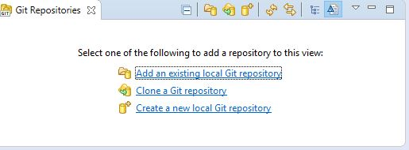 
<br>

- Step 4:&nbsp; Browse to your local repository wher you have cloned the project. <br>

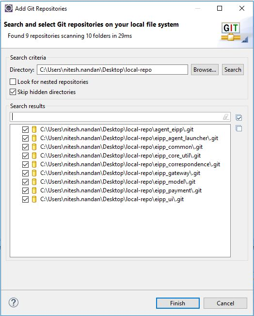 <br> 

Step5: Import these Project one by one, it will be added to project explorer.

Don't change any default setting click on finish button. Repeat the same for each project.

After checking out all the project it will looks something like: <br><br>
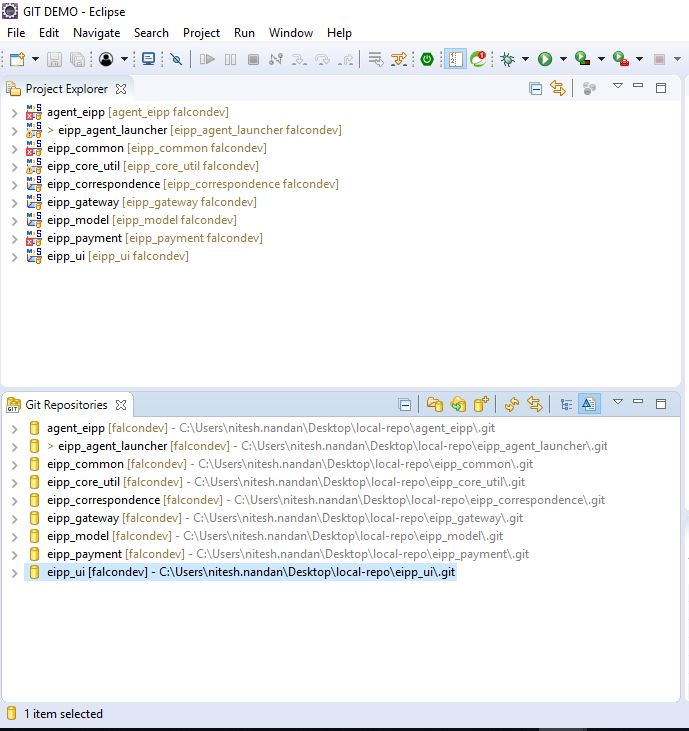 <br> 

You can see the falcondev is checkout as your working branch in project explorer.

---

## [**Setting up the remotes: See the Advantage**](#important-links)

You don't have to setup the remotes explictily, it has been taken care of while cloning the project itself. You might confused what are the remotes? 

Remotes are nothing but a reference or url of the repositories. Since Git is distributed system, we can have multiple cloned repository hence a multiple references. Let take a example to understand better, A team has 15 developer, since all the developer works on their forked repository and forked repository is nothing but a clone of Official Repository. It mean we have 15 (user's public repository) + 1 (Official Repository), hence 16 different remotes of a repository.

### Advantage

Now suppose you want to take some code that is in developing stage from few team members. In case of CVS we have no option other then explictily asking the code and sending throuhg the mail, but in GIT you can fetch the changes with the help of url, even you can compare you code and take only changes that you want, it is nothing but you can collabrate much easily with you team.

You can check the remote using the following command:
<pre>
    $ git remote  // list all the remote
    $ cat .git/config // display the content of local configuraiton file, which also holds the remote's references
</pre>

List of the remotes: <br><br>

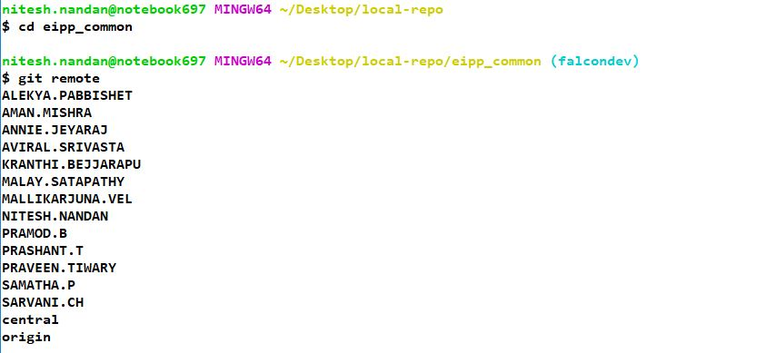 <br> 


---

## [**Feature Branch Creation**](#important-links)

As per the simplicity you **shouldn't work on falcondev** branch rather you should create a **feature branch (user story)** and  then work on it. There are several advantage of doing so, I will discuss all these in coming sections. I assume you must be knowing how to create a branch in eclipse. Suppose in eclipse workspace we have 10 projects then to make a featute branch we have to go through each one of the repository, which is not very handy.

There is **__create_branch.sh__** script which creates a feature branch in all the repositories in one go. 

Before you use the **create_branch** you should change few lines in the **create_branch.sh** file as per your team.

``` bash
#!/bin/bash
eipp_cloud="agent_eipp eipp_common eipp_correspondence eipp_model eipp_ui eipp_core_util eipp_gateway eipp_payment eipp_agent_launcher"

/* 
    some code here
*/

if [ "$operation" == 'csw' ]
then
   for project in $eipp_cloud
    /* 
        some code here
    */
    done

elif [ "$operation" == 'sw' ]
then
    for project in $eipp_cloud
     do
    /* 
        some code here
    */
     done
else
   /* 
        some code here
    */
fi
```

You can see similar to **clone** script there is **eipp_cloud** variable, modify the variable as you have done in clone script. Now you are ready to go.

<pre>
    $ create_branch [csw/sw] [branch_name]
</pre>

**create_branch** takes **two argument** first one is a **flag** and second one is **branch_name.**

 1. **&nbsp; csw:&nbsp;** It will create a new_branch and checkout the newly created branch.<br>
 2. **&nbsp; sw:&nbsp;** It will switch to branch existing one. (It will not create a new branch.)

 #### Creating branching and switching(csw): <br>

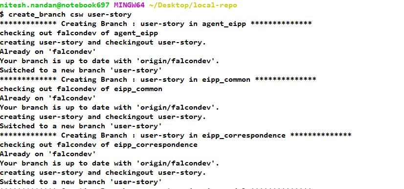 <br><br>

 #### Switching to existing branch(sw): <br>

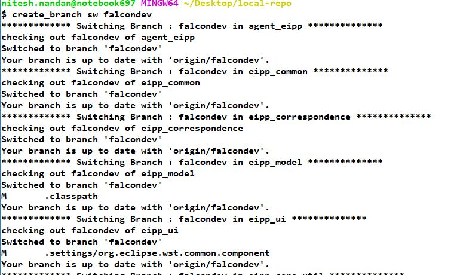 <br><br>

--- 

## [**Taking Daily Update**](#important-links)

In HighRadius Git Workflow we have three repositories: <br>
1. &nbsp;<strong> Official Repository:</strong> &nbsp; This is the repository from where user forked. All the builds happen here and finally everyone contribute their changes here.<br>
2. &nbsp; <strong>User's Public Repository:</strong> &nbsp; This is forked repository from where we clone to our local. <br>
3. &nbsp; <strong>Local Repository:</strong> This repository resides in your local system (eclipse). 

**See the image:** <br>

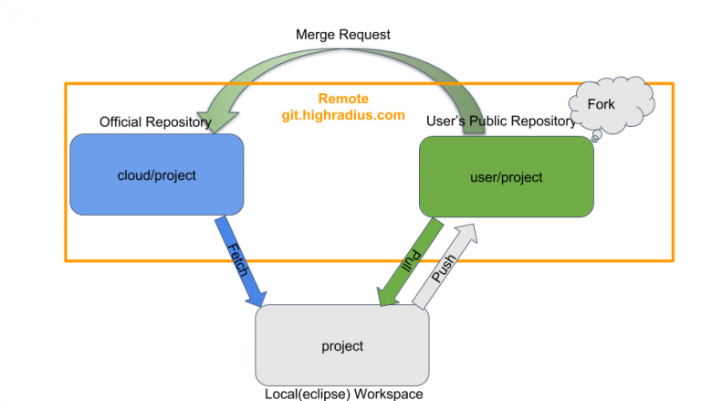 <br><br>

### **Convention over configuration**

1. &nbsp; You should **never** work on **falcondev**, always create a feature-branch and work. <br>
2. &nbsp; Before running the script you **should't** have any **untracked or modified** file in your workspace (not mandatory but highly recommended). <br>
3. &nbsp; Commit your changes to your **feature branch** before running the daily_update script. <br>

### **Why these conventions: Behind the scene**

The above conventions has made to keep our falcondev branch unchanged from your local change, hence the commit history will be remain unchanged and we can take the advantage of fast-forward merge which is conflict free merge.

There are basically two types of merge happens in GIT:
1. &nbsp; Fast-Forward Merge
2. &nbsp; Recursive Merge (three-way merge)

The detailed explanation is out of scope, for now we can say **Fast-Forward** merge is **conflict free** merge and it happens when commit history remains unchanged.

Daily Update script mainly do three operation for each of the branch:
1. &nbsp;At first it will **fetch** (download) all the upcoming changes from **Official** repository.
2. &nbsp; Second operation will **merge** the latest fetched changes to your local repository branch.
3. &nbsp;Finally, It  **Push** the changes to your's cloud repository.

<strong>Note: &nbsp;</strong> Fetching (downloading) the changes never creates a conflict nor it changes you working directory, it updates only local remote directory.

<pre>
    $ daily_update [branch-name]
</pre>

Here branch-name is optional, if you don't provide the branch-name, after update your working branch will remain unchaged.

---

## [**Checking the update status**](#important-links)

The aim of daily_update script is to keep our local and forked repository in sync with the Official Repository. If the last commit id is same in all the three repository, then we can say our repository is in sync, or commit in local falcondev should not be behind from the commit of Official Repository.

There is a script named as **show_sync** which helps you to decide whether your repositories are in sync or not. 

<pre>
    $ show_sync [repository-name]
</pre>

Here repository-name is optional argument, if you don't give it will show for all the repository that are listed in the script.

#### show_sync with argument: <br>

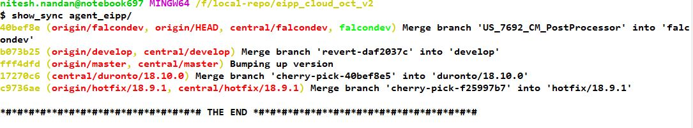 <br><br>

 #### show_sync without argument: <br>

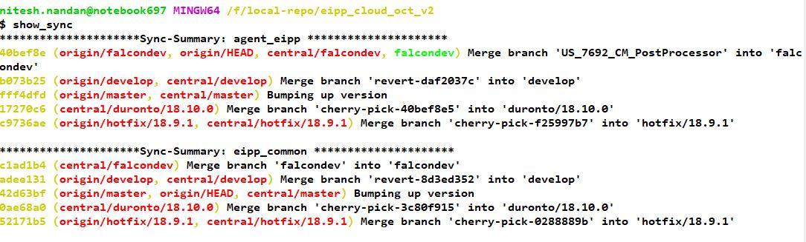 <br><br>

---

## [**Merging the feature Branch**](#important-links)

As we have discussed prviously, we should always work on feature branch, so when we done with our work, we should merge feature branch with the latest code of falcondev and push to our public repository.

Now the questiton is how effectively and efficiently we do the merge. There are several method through which we can merge the change, it totaly depend on the context.

These are the several methods: <br>
1. Recursive merge (Normal merge, three-way merge).<br>
2. Squash Merge <br>
3. Selective Merge.
4. Rebase 


<strong> Recursive Merge: &nbsp; </strong> This merge should be perfomed when the feature-branch has lots of changes and most of the file are new and **probablity of getting conflicts is very less.**

There is seperate script to perfom this kind of merge named as **feature_merge**.
This feature_merge will generate a  consolidated file of all the action also pointing out the **conflict file** if merge get failed. As per my experience in HighRadius, we perform these merge very often but our changes are limited to only few repositories. So, I will suggest do it manually.

 **Merging through script (feature_merge):** <br>

<pre>
    $ feature_merge [feature_branch_name]
</pre>

This script has to run from directory which contains all the git repository.

 **Merging Manually using git bash (Repeat for all the projec which has change):**

The git command for this merge is: <br>
<pre>
    $ git merge [feature_branch_name]
</pre>

<strong>Notes: &nbsp;</strong> You should be carefull with your branch while merging, i.e. you should first checkout the branch where you want to merge your feature branch. 

for eg: &nbsp; Suppose you want to merge your feature_branch to falcondev, then before performing the action you should checkout falcondev and the run the command.


<strong> Squash Merge: &nbsp; </strong> The command for this merge is similar to the three-way merge, but the difference is it puts all your changes in a working/indexed area and from there you have to commit, this helps you to maintain a clean and tidy commit history.

The git command for this merge is: <br>
<pre>
    $ git merge [feature_branch_name] --squash
</pre>

<strong> Selective Merge: &nbsp; </strong> This merge is highly encouraged when there are high chance of getting the conflict or you have lots of small changes in a single file. This merge comes very handy while fixing the bug or doing the small changes. You will be doing this very often.

You can do selective merge through eclipse comparing the file with the feature branch file.

**See the image:**

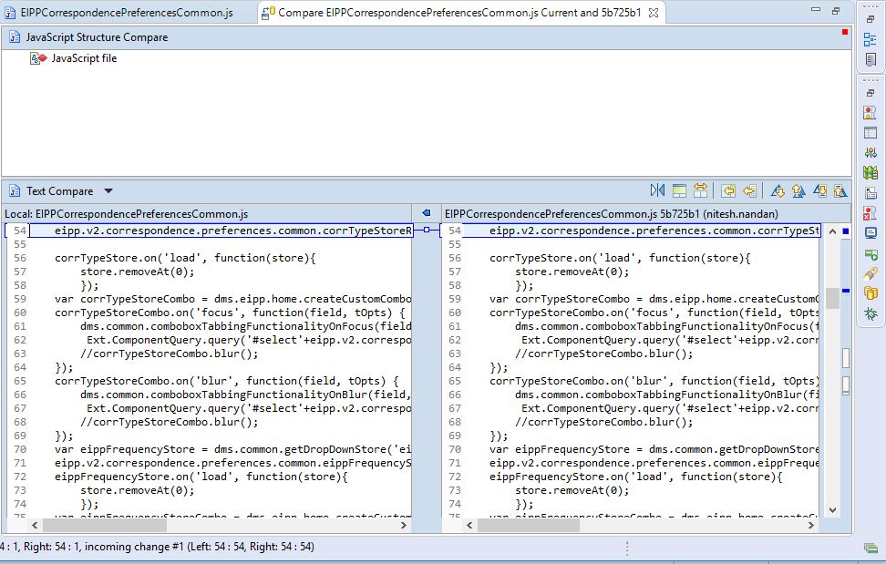 <br><br>


<strong> Rebase: &nbsp; </strong> I personally don't like this merge with the context of HighRadius. 

These are few reason why I don't like and also suggest not to use:<br>
1. It will destroy the commit id and create a new commit id for your feature branch.
2. It will create multiple commits for a userstory which is not encouraged.
3. It is little complex as compare to previously discussed merge.

---

## [**Tracking the conflict file**](#important-links)

While merging the our changes, we often get the conflict, though eclipse will show the red mark after removing the conflict also it generally doesn't change. So, I have written a script to list down all the conflict files from your workspace, so once you do with the resolving with conflicts, you can run the script to cross check.

When there is conflict we get some conflict marker like:
<pre>
    <<<<<<< HEAD
        Hello world
        =======
        Goodbye
    >>>>>>> 
</pre>

So, the script search for the string **"<<<<<<<"** in your workspace, if it find it will return the absolute path of that file.

So, this script doesn't tell exactly whether the file has actual conflict or not. So if some developer used this symbol intentionally then also it will show as conflicted file, use you wisdom there. Generally we never use this symbol during development.

Running this command **may take few seconds** as it has to go through all the file.

**See the image:**

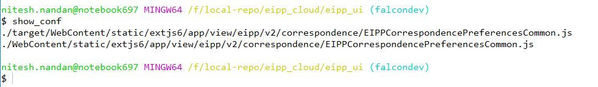 <br><br>


This script comes very handy when multiple file has conflict and you totaly lost the track.

--- 

## [**Tracking the Modified/Untracked file**](#important-links)

As we work on multiple project and therefore somtimes it is become difficult to track all the changes what we made.

There is script called show_unt it will list down all the modified and untracked file from your workspace.

It comes very useful before running the daily_update as I have already suggested you should commit all your changes before taking daily_update.

The command goes like: <br>
<pre>
    $ show_unt
</pre>

**See the image:**

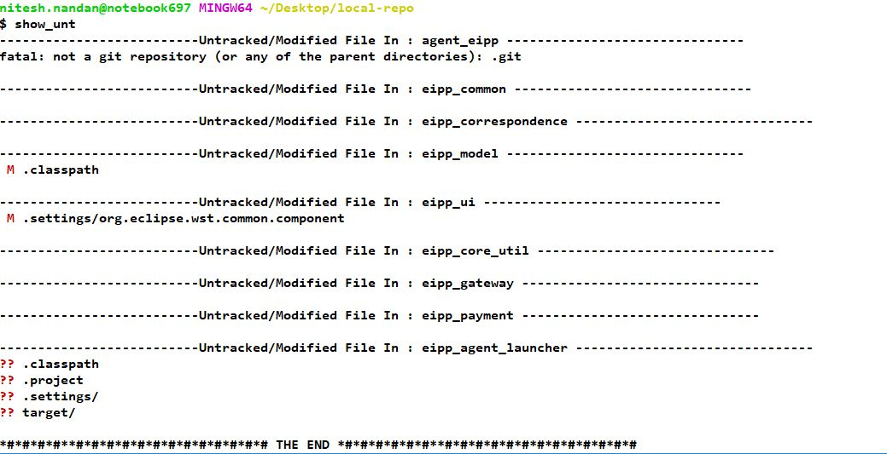 <br><br>

---

## [**Deleting the feature Branch**](#important-links)

As we usually worked on feature_branch, so when you done with the your task you might want to delete the branch. Therefore there is a script called 
delete_branch which does the same in all the repository of workspace.

There is two types of delete when comes to deleting the branch in git.
1. Soft delete
2. Hard delete

In soft delete the branch will not get deleted if it is not merged with any other branch. It will save you if you run the command by mistake.

In hard delete the branch will be deleted irrespective of whether it is merged or not. So, be carefull while perfoming the delete. 

Deleting the branch will also delete all the commit related to that branch.

script command: <br>
<pre>
    $ delete_branch [branch_name] [hard(O)]
</pre>

Here **branch_name is mandatory** and **hard is optional argument**. If you don't provide hard, it will try to perform soft delete.

The git command for deleting the branch is: <br>
<pre>
    $ git branch -d [branch_name]           // soft delete
    $ git branch -D [branch_name]           // hard delete
</pre>

---

## [**Fetching the code from user's cloud repository**](#important-links)

I personally feel the power of distributed version system like GIT when collabration comes in to picture. In CVS, we share our code throgh mail or drive, thanks to distributed system which makes very easy to share your code or even your workspace.

In clone script, I have introduced the concept of remote and while cloning a repository itself script will add all the remotes, so you don't need to take extra pain.

#### Problem Statement: 
Let's suppose you and some of your team members are working on a user-story. During the development you want code from your group member, since code is not fully functional so your friend can't push the code to official repository. So how to take the Update?

**Solution:&nbsp;**
Here comes remote in action, remote is nothing but a link to repository that also exist somewhere in the cloud. So as you are fetching the latest change from Official Repository, similar way you can also fetch the changes from your friends repository.

<strong> Note:&nbsp; </strong> In HighRadius everybody has read (fetch) aceess for all the repository exist in HighRadius git cloud.

Command for the Opearation:
<pre>
    $ git fetch [remote-name]
</pre>

Here remote-name is mandatory parameter which holds the link and references of the repository.

<strong> Note:&nbsp; </strong> This will only download the code from the link it will not merge to your working directory. So to take the change to working directory it has to be merged.

---

## [**Commit Message Generation**](#important-links)

The good commit message is always encouraged. You might fell writing a commit message is very easy, but believe me writing a good and clean commit message might not be so hard but it is time consuming. The another problem is suppose we write 10 commit message, there might be a high chance that we landup in 10 different format of commit message.

This only works when your commit the change using git bash.
After adding your changes in staging are you can commit as :
<pre>
    $ commit // this is modified version of git commit
    $ git commit // this is default command that git bash support
</pre>


This will open a editor (default editor) like this:

-- image


---

## [**Short Hand commands**](#important-links)

These commands are written with the help of basic commands that exist in UNIX bash shell to save your time.

These short hand commands are called alias.<br>
<strong>Note: &nbsp;</strong> All short hand commands are present in <i><strong><i>.bash_profile</i></strong></i> file. You can chage the value as per your need.


### Basic Commands

1. <strong> &nbsp;subl: &nbsp;</strong> This comand will open your sublime text editor, if it is avialble in <i>C</i> drive. You can change the default location in <i><strong><i>.bash_profile</i></strong></i> file. <br>

2. <strong> &nbsp;repo: &nbsp;</strong> This command directly take you to the local repository where git repository is located.<br>

3. <strong> &nbsp;gd: &nbsp;</strong> This command directly take you to the desktop.<br>

4. <strong> &nbsp;ccd: &nbsp;</strong> This command takes one argument. This command will create a folder with the name passed as argument and also take you inside the newly created directory. This command is integration of two basic comands. <pre>
    $ mkdir [folder-name]
    $ cd [folder-name]
</pre>

5. <strong> &nbsp;del : &nbsp;</strong> It will take one argument and delete the file/directory as passed in argument.<br>

### Git Specific Commands

**Note:&nbsp; <i>All the git specific commands which works on multiple git repository at a time, must be executed from folder containing all the git repositorires, not from a git repository.</i>**

1. <strong> &nbsp;clone: &nbsp;</strong> It will take your ldapId (username) as argument and download all the forked repository listed in the script in current working directory. [Click Here](#setting-up-workspace) for more details.<br>

2. <strong> &nbsp;graph: &nbsp;</strong> This command will display commit history graph of working git directory.<br>

3. <strong> &nbsp;daily_update: &nbsp;</strong> This command will help you to keep your local and forked repository with Official Repository. [Click Here](#taking-daily-update) for more details.<br>

4. <strong> &nbsp;create_branch: &nbsp;</strong> This will create/switch to a feature branch or both. [Click Here](#feature-branch-creation) for more details.<br>

5. <strong> &nbsp;delete_branch: &nbsp;</strong> This will delete the branch with name that has passed as argument. [Click Here](#deleting-the-feature-branch) for more details.<br><br>


6. <strong> &nbsp;feature_merge: &nbsp;</strong> It takes feature-branch name as argument and this branch will be merged to falcondev. Also generate a summary file named as <i>[feature-branch name]_merge_summary.txt </i>Click Here]() for more details. [Click Here](#merging-the-feature-branch) for more details.<br>

7. <strong> &nbsp;show_sync: &nbsp;</strong> This script will help you to figure out whether you local and forked repository are on sync or not. [Click Here](#checking-the-daily-update) for more details.<br>

8. <strong> &nbsp;show_unt: &nbsp;</strong> This will display the list of all the modified or untracked file that has yet to commit. [Click Here](#tracking-the-modified-untracked-file) for more details.<br>

9. <strong> &nbsp;show_pdiff: &nbsp;</strong> This will list down all the file name that has been created or modified in feature_branch.
<strong>Note: &nbsp;</strong> This command should only run in feature branch, created using create_branch script.<br>

10. <strong> &nbsp;show_diff: &nbsp;</strong> This will list down all the file name that has been created or modified from last commit. <br>

11. <strong> &nbsp;show_cmg: &nbsp;</strong> This will display last generatd commit message.<br>

12. <strong> &nbsp;show_gcmg: &nbsp;</strong> This will generate a fresh commit message and diplay in bash shell. This should call when you are working on feature branch only.

13. <strong> &nbsp;git_help: &nbsp;</strong> This will be list down all the git specific customised commands.<br>
<strong>Note: &nbsp;</strong> you can also type alias in bash shell. It will print all alias (short-hand) commands present in <i><strong><i>.bash_profile</i></strong>.</i><br>

14. <strong> &nbsp;last_commit: &nbsp;</strong> 

### Bonus Commands

1. <strong> &nbsp;node1: &nbsp;</strong> This will open the chrome browser<br>

2. <strong> &nbsp;node2: &nbsp;</strong> You can see FIT Node1 log using this command. Make sure you have the fit log access.<br>

2. <strong> &nbsp;node3: &nbsp;</strong> You can see FIT Node2 log using this command. Make sure you have the fit log access.<br>

2. <strong> &nbsp;chrome: &nbsp;</strong> You can see FIT Node3 log using this command. Make sure you have the fit log access.<br>

---

## [**Frequently asked questitions (FAQ)**](#important-links)

<strong> &nbsp;Q 1: &nbsp;</strong> How many local git repository we can have ? <br>
<strong> &nbsp;Ans: &nbsp;</strong> You can have as many as repositoy you want, until your's disk is run out of memory.<br> <br>

<strong> &nbsp;Q 2: &nbsp;</strong> How many feature branch I can create in git? <br>
<strong> &nbsp;Ans: &nbsp;</strong> You can create as many as branch, there is no limitation in no of branch.<br> <br>

<strong> &nbsp;Q 3: &nbsp;</strong>Is it mandatory to take daily update ? <br>
<strong> &nbsp;Ans: &nbsp;</strong> No, It is not mandatory to take the update daily but make sure befor you push your changes it should have updated code and doesn't break functionality.<br> <br>

<strong> &nbsp;Q 4: &nbsp;</strong> How many feature branch I can create in git? <br>
<strong> &nbsp;Ans: &nbsp;</strong> You can create as many as branch, there is no limitation in no of branch.<br> <br>

<strong> &nbsp;Q 5: &nbsp;</strong> How many feature branch I can create in git? <br>
<strong> &nbsp;Ans: &nbsp;</strong> You can create as many as branch, there is no limitation in no of branch.<br> <br>

<strong> &nbsp;Q 6: &nbsp;</strong> How many feature branch I can create in git? <br>
<strong> &nbsp;Ans: &nbsp;</strong> You can create as many as branch, there is no limitation in no of branch.<br> <br>

<strong> &nbsp;Q 7: &nbsp;</strong> How many feature branch I can create in git? <br>
<strong> &nbsp;Ans: &nbsp;</strong> You can create as many as branch, there is no limitation in no of branch.<br> <br>


